# Ai 大模型本地部署基础教程

## 什么是本地部署？为什么要本地部署？模型参数数量对模型性能的影响？

本地部署是指将人工智能（AI）大模型或其他软件应用程序直接安装在本地服务器或个人电脑上，而不是通过云服务提供商进行托管和运行。这种部署方式通常涉及将模型的所有必要组件和数据都集中在用户的内部网络中。

### 本地部署的几个主要优势包括：

1. **数据隐私与安全性**：许多企业和组织处理敏感数据，如用户个人信息、财务数据等。本地部署可以确保这些数据不会被上传到第三方云服务，有助于保护隐私和满足法规要求（如 GDPR）。

2. **降低延迟**：本地部署可以减少网络传输的延迟，尤其是在需要实时处理的应用场景中（如自动驾驶、医疗设备等）。

3. **控制与定制**：在本地部署可以让企业更好地控制其运行环境，包括硬件配置、软件更新以及模型的定制化，从而满足特定的业务需求。

4. **避免云计算成本**：对于一些需要长时间运行的应用，云服务的费用可能会迅速增加。通过本地部署，企业可以避免持续的云计算费用。

5. **依赖性降低**：本地部署减少了对外部服务的依赖，使得企业能够在网络中断或云服务故障时仍然正常运行。

6. **模型优化**：一些高级用户或数据科学家可以在本地环境中更灵活地对模型进行调试、优化和实验，而不受云平台的限制。

### 适用场景

- 大型企业需要对数据进行严格的保护。
- 对延迟有严格要求的实时应用。
- 长期、稳定的计算任务。
- 将特定应用集成到现有内部系统中。

虽然本地部署有许多优点，但也存在一些挑战，例如需要较高的硬件投入、技术维护成本、软件更新、扩展性问题等。

> 以当前的 DeepSeek-R1 为例，要在本地跑满 671b 大小的模型，大概需要预算 90 万 - 500 万，[预算详情](Budget.md)

> 字母 b 代表 billion (十亿)，671b 意味着模型有 6710 亿个参数

### 参数数量对模型性能的影响

- **表现力** ：更大的模型（更多的参数）通常可以更好地拟合复杂数据，在很多情况下能取得更好的性能。它们能够捕捉到更细粒度的特征和语义信息。

- **计算资源**：参数越多，训练和推理所需的计算能力和内存通常也越高。这意味着训练更大的模型需要更多的硬件资源和时间。

- **过拟合**：尽管大模型有更强的表达能力，但也更容易发生过拟合，特别是在训练数据不足的情况下。

- **部署**：大模型在部署时可能会面临延迟和存储问题，因此在实际应用中选择合适的模型大小是关键。

> 举例本地运行的 llama3.2(3b) 模型，提问其 9.9 与 9.11 哪个数字大时，回答是错误的，在其他问题上提供的帮助也很有限

## 我的电脑可以部署多少参数的模型？

一般来说，7b 数量级模型需要至少 8GB 的运行内存，13b 数量级模型需要至少 16GB 的运行内存，33b 数量级模型需要至少 32GB 的运行内存。实际运行速度与配置，显卡配置有关。

配置详情参考文章：[配置详情](Requirments.md)

## 本地部署准备工作

本教程将使用 Orbstack(MacOS 的容器平台) ➕ Ollama (开源的大型语言模型平台) ➕ Open WebUI (大模型的图形化界面) 简单搭建一个本地大模型。

> 为什么我要使用 Orbstack 容器平台？参考文章：[Orbstack 性能优势](./FurtherReading/MacOS系统上Orbstack和Docker%20Desktop性能优势？.md)

### 1. 安装 Ollama

- [Ollama 官方下载](https://ollama.com)

安装完成后，打开终端尝试运行命令，如果出现提示信息，说明安装成功。

```bash
$ ollama
```

示例图：

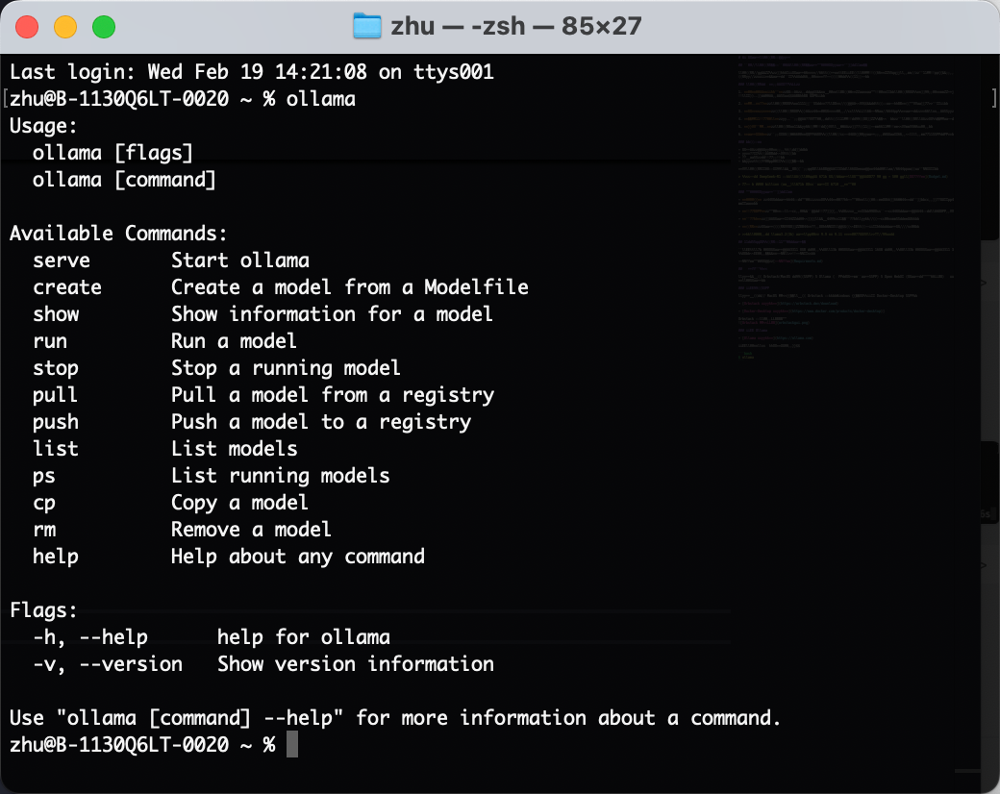

### 2. 下载拉取对应模型

在 Ollama 官网中 Models 里列举了很多模型信息，可以根据需要选择，这里选择 DeepSeek-R1(8b) 为例：

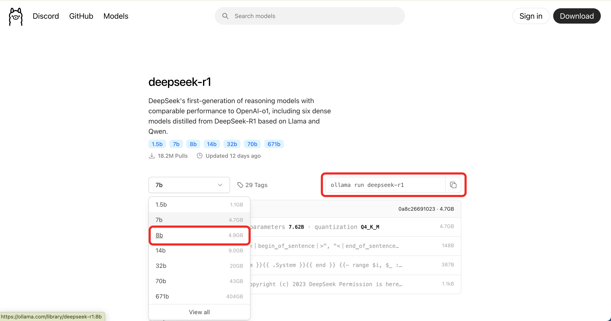

复制运行命令到终端中运行：

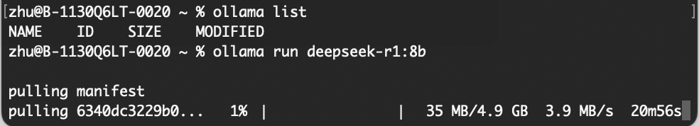

可以看到已经开始了下载进程。进程结束后，本地就可以运行这个 AI 模型进行对话了：

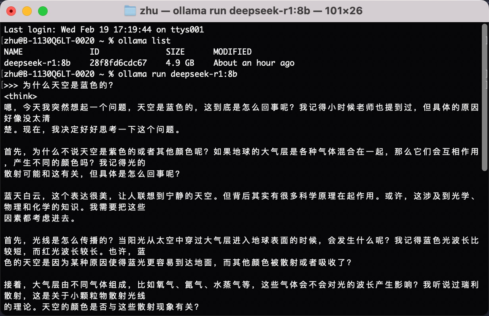

但是终端里的内容并不方便查看，使用起来也比较繁琐，接下来我们尝试给他部署到 Open WebUI 中来实现图形化操作界面。

### 3. 安装容器平台

为了使用 Open WebUI，我们需要一个容器平台来运行他。这里我们使用的是 Mac 操作系统，以 Orbstack 作为容器平台。

Windows 系统可以选择 Docker-Desktop 平台。

- [Orbstack 官方下载](https://orbstack.dev/download)

- [Docker-Desktop 官方下载](https://www.docker.com/products/docker-desktop)

Orbstack 基本运行界面如图

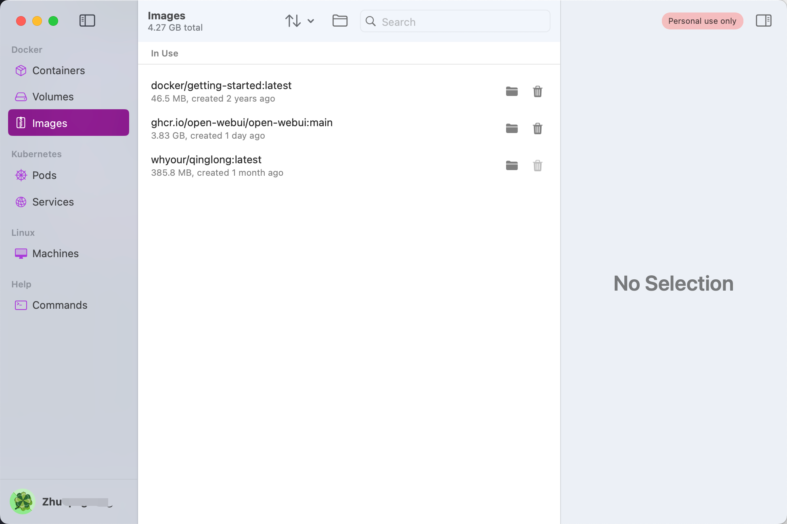

### 4. 安装 Open WebUI

[Open WebUI GitHub 主页](https://github.com/open-webui/open-webui)

因为我们使用的是 Docker 安装，所以在 GitHub 页找到 `Quick Start with Docker 🐳` 一栏：

可以看到，当电脑上已经安装有 Ollama 的话，可以使用这个命令

```bash
docker run -d -p 3000:8080 --add-host=host.docker.internal:host-gateway -v open-webui:/app/backend/data --name open-webui --restart always ghcr.io/open-webui/open-webui:main
```

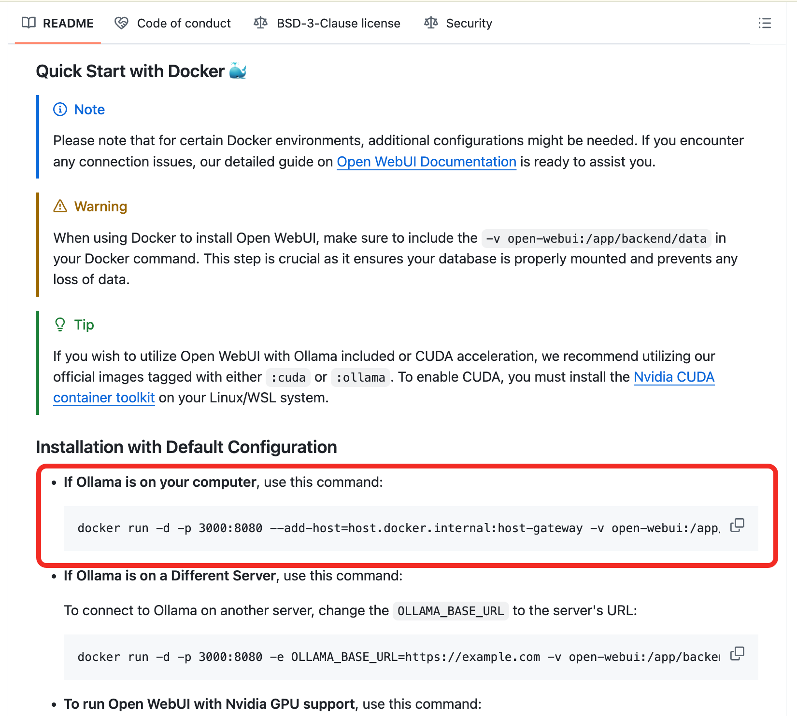

终端运行命令后执行安装过程，大小大概 3GB：
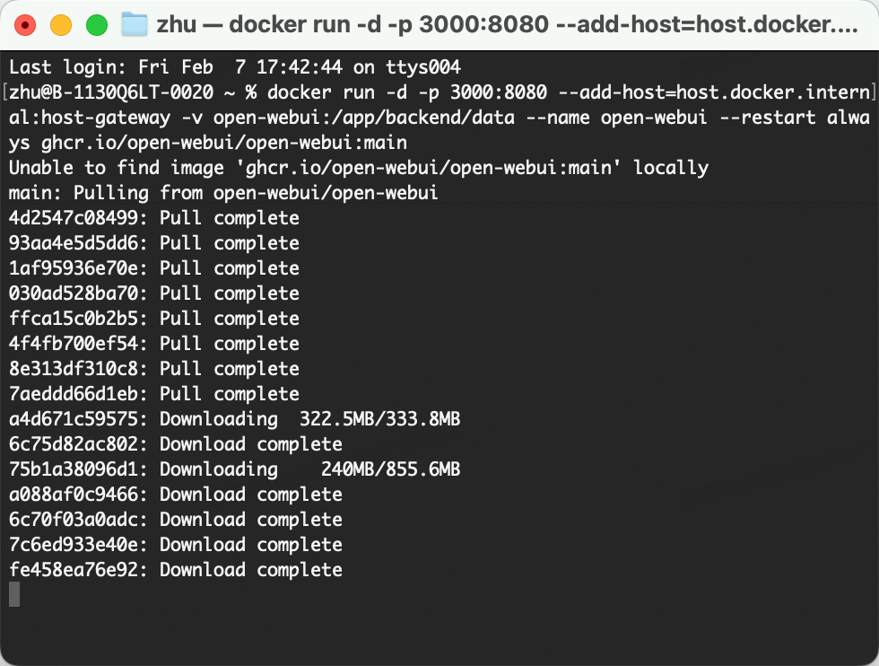

## 运行本地大模型

完成以上步骤后，我们开始运行准备：

1. 运行 Ollama，运行成功后 Mac 右上角会有应用图标展示；

2. 运行 Open WebUI 容器：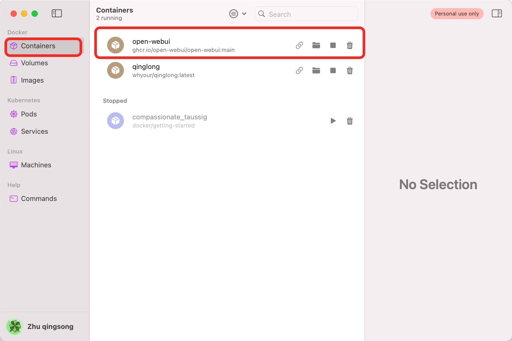

3. 打开 Orbstack 选择 Open in Browser 浏览器打开 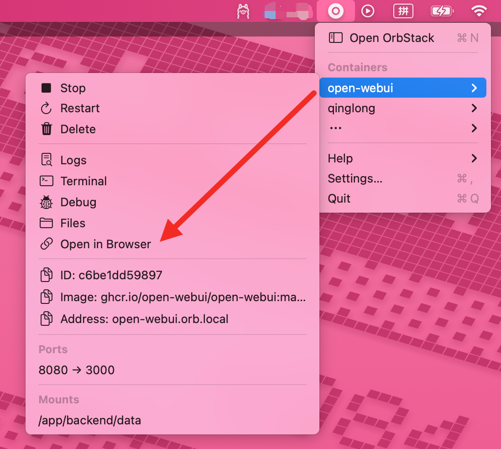

出现以下界面代表运行成功:

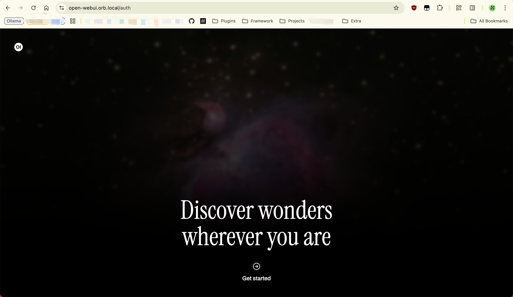


**初次配置的账号密码拥有管理员权限，请注意保存**

### 运行示例

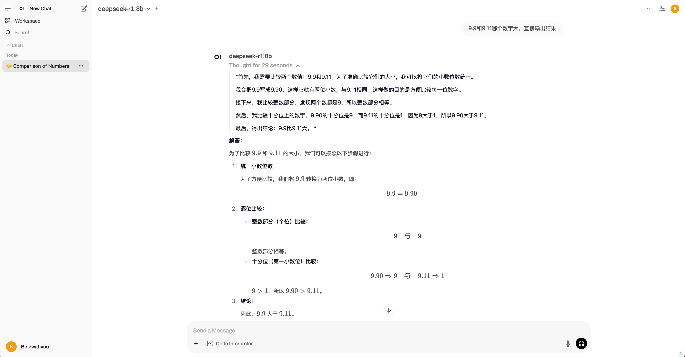

## FAQ

### 我可以选择部署比如 Qwen 或者其他模型吗？

可以，**开源**的大模型预言都可以进行本地部署，详细模型列表可参考：[Ollama 官方模型列表](https://ollama.com/search)

### 我一定要安装像 Orbstack 这样的容器平台吗？

如果要使用 Open WebUI，官方还提供了通过 Python 的安装方法，参考：[通过 Python 安装 Open WebUI](https://github.com/open-webui/open-webui?tab=readme-ov-file#installation-via-python-pip-)

### 我不想使用 Open WebUI，有没有其他的平台可以使用？

可以参考 Ollama 官方推荐的平台列表：[网页&桌面客户端集成](https://github.com/ollama/ollama?tab=readme-ov-file#web--desktop)

### 模型部署后运行速度慢怎么办？

检查计算机配置是否符合要求，本地部署的模型参数数量是否过高，升级电脑硬件配置。
