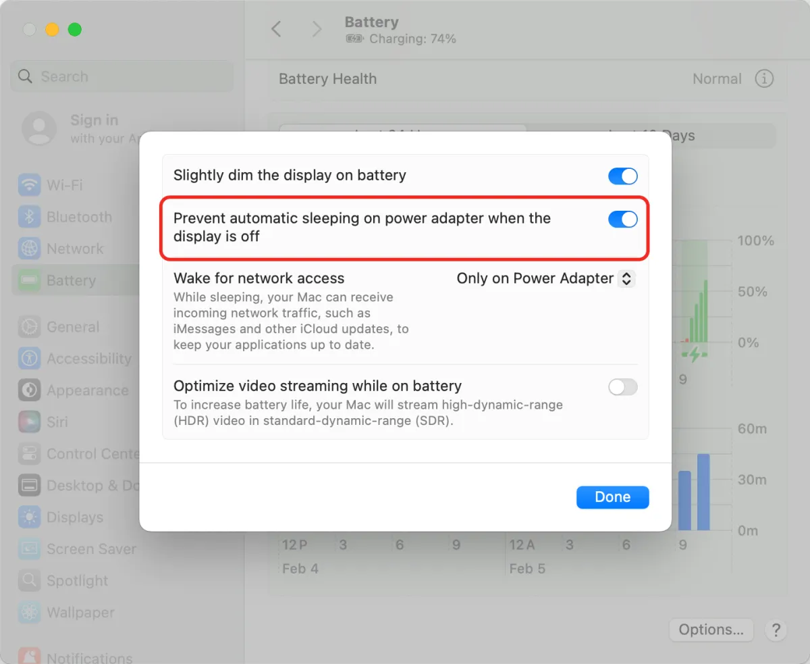

# 阻止Mac自动休眠有哪些办法？
> 当电脑需要后台运行一些需要长时间运行的任务时，例如下载、上传、渲染、后台脚步等，需要保持电脑长时间运行状态，而不进入休眠
## 1. 电池电源策略🔋
打开“接入电源状态下，显示屏熄灭时阻止休眠 `Prevent automatic sleeping on power adapter when the display is off` 选项
### 1.1 方法
设置 -> 电池 -> 选项(右下方) -> 打开上述选项

> 该方法仅适用于电脑接入电源的情况下，如果电脑没有接入电源时，需要使用其他办法。
## 2. caffeinate
`caffeinate` 是 macOS 系统中一个强大的命令行工具，用于控制系统的睡眠行为，确保在执行某些任务时系统保持活跃状态。通过使用不同的选项，用户可以精确地管理系统的睡眠、显示器关闭、硬盘休眠等行为，从而保证长时间运行的任务如下载、视频渲染、备份等不中断。
### 2.1 常用选项